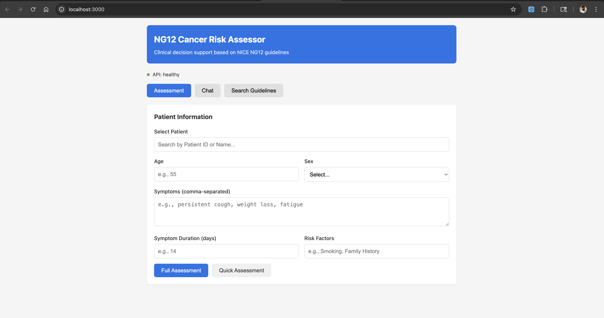
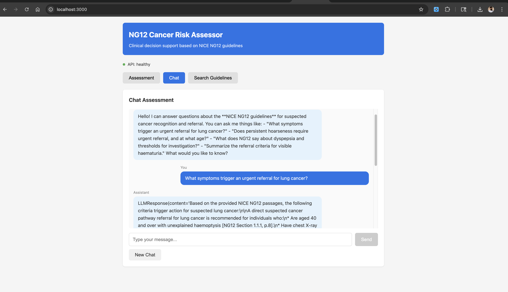
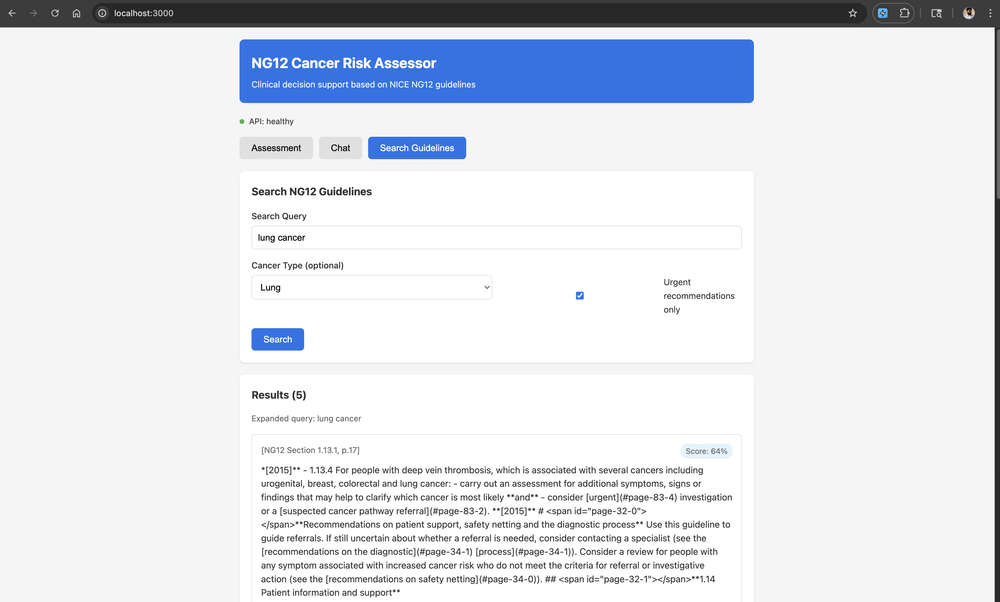

# Cancer Risk Assessment System (NG12)

A Clinical Decision Support System that combines structured patient data with NICE NG12 guidelines to provide automated cancer risk assessment and conversational clinical guidance. Built with RAG (Retrieval-Augmented Generation), a ReAct agentic framework with 7 specialised clinical tools, and Google Vertex AI Gemini 2.5 Pro.

**Key Features:**
- **ReAct Agent** — Transparent, step-by-step clinical reasoning with full audit trail
- **7 Clinical Tools** — Specialised tools for symptom extraction, red flag detection, guideline search, risk calculation, referral pathways, cancer criteria lookup, and section retrieval
- **Shared RAG Pipeline** — Single ClinicalRetriever with query expansion, patient-context search, and metadata filtering serves both assessment and chat
- **Metadata-Enhanced Embeddings** — Clinical context prepended before embedding improves retrieval accuracy
- **Conversation Flow Management** — Context question detection distinguishes info-gathering, follow-ups, and assessment requests
- **Automated Evaluation** — Recall@K, MRR, NDCG, MAP, Hit Rate with metadata-driven ground truth (no manual labeling)
- **Guideline-Grounded Responses** — Every claim traces back to NG12 with page-level citations

---

## Table of Contents

1. [Quick Start](#quick-start)
2. [System Architecture](#system-architecture)
3. [Technical Stack](#technical-stack)
4. [ReAct Agent and Clinical Tools](#react-agent-and-clinical-tools)
5. [Retrieval Pipeline](#retrieval-pipeline)
6. [Evaluation Pipeline](#evaluation-pipeline)
7. [Techniques and Algorithms](#techniques-and-algorithms)
8. [Design Trade-offs](#design-trade-offs)
9. [Improvemnets If Time Permits](#improvments-if-time-permits)
10. [API Endpoints](#api-endpoints)
11. [Project Structure](#project-structure)
12. [Setup Guide](#setup-guide)
13. [Usage Examples](#usage-examples)
14. [UI images](#ui-images)

---

## Quick Start

### Option A: Docker (Recommended)

```bash
# Clone and setup
git clone <your-repo>
cd cancer-assessor

# edit .env files

# Build image
docker-compose build

# Run with mock mode (no GCP required)
USE_MOCK=true docker-compose up

# For run with VertexAI 
docker-compose up

# API: http://localhost:8000/docs
# Frontend: http://localhost:3000

refer : SETUP_GUIDE.MD for more details

```

### Option B: Local Python (github codespace recommended)

```bash
# Create virtual environment
python -m venv venv
source venv/bin/activate  # Windows: venv\Scripts\activate

# Install dependencies
pip install -r requirements.txt

# edit .env file

# Start API with mock mode
USE_MOCK=true uvicorn src.main:app --reload --host 127.0.0.1 --port 8000

# Start API with VertexAI Mode
uvicorn src.main:app --host 127.0.0.1 --port 8000

# Access at http://127.0.0.1:8000/docs (backend)

# In another terminal, start frontend
cd frontend && npm install && npm run dev

# Access at http://localhost:3000(frontend)

refer : SETUP_GUIDE.MD for more details

```

---

## System Architecture

### High-Level Overview

```
┌─────────────────────────────────────────────────────────────────┐
│                         CLIENT LAYER                            │
│         (Minimal frontend: 2 tabs — Assessment + Chat)          │
└───────────────────────────┬─────────────────────────────────────┘
                            │
┌───────────────────────────▼─────────────────────────────────────┐
│                       FASTAPI LAYER                             │
│  POST /assess  POST /assess/quick  POST /assess/stream          │
│  POST /chat    GET /chat/{id}    GET /search    GET /system     │
└───────────────────────────┬─────────────────────────────────────┘
                            │
                     dependencies.py (DI)
                            │
┌───────────────────────────▼─────────────────────────────────────┐
│             AGENT ORCHESTRATION LAYER (ReAct)                   │
│  ┌──────────────────────┐      ┌──────────────────────────┐     │
│  │  Clinical Agent      │      │  Chat Agent              │     │
│  │  (ReAct: Thought →   │      │  (Context Question       │     │
│  │   Action → Observe)  │      │   Detector + RAG)        │     │
│  └──────────┬───────────┘      └──────────┬───────────────┘     │
└─────────────┼────────────────────────────┼──────────────────────┘
              │                            │
              └──────────┬─────────────────┘
                         ▼
┌────────────────────────────────────────────────────────────────┐
│                  7 CLINICAL TOOLS                              │
│  ┌─────────────────┐ ┌─────────────────┐ ┌─────────────────┐   │
│  │🔎 search_       │ │🚩 check_        │ │📊 calculate_    │   │
│  │  guidelines     │ │  red_flags      │ │  risk           │   │
│  │  (RAG)          │ │  (RAG+urgency)  │ │  (rules)        │   │
│  ├─────────────────┤ ├─────────────────┤ ├─────────────────┤   │
│  │🏥 get_referral_ │ │💊 extract_      │ │📋 lookup_cancer_│   │
│  │  pathway        │ │  symptoms       │ │  criteria       │   │
│  │  (RAG+filter)   │ │  (LLM)         │ │  (RAG+filter)    │   │
│  ├─────────────────┤ └─────────────────┘ └─────────────────┘   │
│  │📄 get_section   │                                           │
│  │  (RAG+section)  │                                           │
│  └─────────────────┘                                           │
└────────────────────────────┬───────────────────────────────────┘
                             │
┌────────────────────────────▼───────────────────────────────────┐
│          SHARED RAG LAYER — ClinicalRetriever                  │
│  ┌──────────────────────────────────────────────────────────┐  │
│  │  • Query expansion (haemoptysis → coughing blood)        │  │
│  │  • Patient-context search (age, symptoms, cancer type)   │  │
│  │  • Metadata filtering (urgency, section, cancer_types)   │  │
│  │  • Three retrieval paths: semantic / patient / section   │  │
│  └──────────────────────────────────────────────────────────┘  │
└────────────────────────────┬───────────────────────────────────┘
                             │
    ┌────────────────────────┼─────────────────────┐
    ▼                        ▼                     ▼
┌─────────────┐  ┌───────────────────┐   ┌──────────────────┐
│  ChromaDB   │  │  Vertex AI        │   │  Gemini 2.5 Pro  │
│  Vector     │  │  text-embedding   │   │  (ReAct, tools,  │
│  Store      │  │  -004 (768-dim)   │   │   structured     │
│  (clinical  │  │  (metadata-       │   │   output)        │
│   search    │  │   enhanced)       │   │                  │
│   methods)  │  └───────────────────┘   └──────────────────┘
└──────┬──────┘
       ▼
┌─────────────────────────────────────┐
│     NG12 Ingested Knowledge         │
│     • 90+ pages indexed             │
│     • ~161 semantic chunks          │
│     • Rich metadata per chunk:      │
│       cancer_types, symptoms,       │
│       urgency, section, type        │
└─────────────────────────────────────┘

┌─────────────────────────────────────────────────────────────────┐
│                     EVALUATION LAYER                            │
│  ┌──────────────────┐  ┌────────────────┐  ┌───────────────┐    │
│  │ Retrieval Metrics│  │ Ground Truth   │  │ Real-Data     │    │
│  │ Recall@K, MRR,   │  │ Builder (auto  │  │ Test Suite    │    │
│  │ NDCG, MAP,       │  │ from chunk     │  │ (per-cancer   │    │
│  │ Precision, Hit   │  │ metadata)      │  │  thresholds)  │    │
│  └──────────────────┘  └────────────────┘  └───────────────┘    │
└─────────────────────────────────────────────────────────────────┘
```

### Risk Assessment Data Flow (ReAct)

```
Patient ID (PT-101)
     ▼
┌─────────────────────────────────────────────────────────────────┐
│ THOUGHT: I need to extract this patient's symptoms.             │
│ ACTION:  extract_symptoms(patient_id="PT-101")                  │
│ OBSERVE: {age: 55, symptoms: [hemoptysis, fatigue],             │
│           negated: [chest pain], smoker: true, duration: 14d}   │
├─────────────────────────────────────────────────────────────────┤
│ THOUGHT: Hemoptysis is a red flag. Let me check.                │
│ ACTION:  check_red_flags(symptoms=["hemoptysis"], age=55)       │
│ OBSERVE: 🚩 RED FLAG — urgent referral trigger (NG12 §1.8)     │
├─────────────────────────────────────────────────────────────────┤
│ THOUGHT: Confirmed. Retrieving specific criteria and pathway.   │
│ ACTION:  search_guidelines("hemoptysis referral criteria")      │
│ ACTION:  lookup_cancer_criteria(cancer_type="lung")             │
│ ACTION:  get_referral_pathway(cancer_type="lung", urgency="2ww")│
│ OBSERVE: [NG12 chunks with referral criteria + pathway]         │
├─────────────────────────────────────────────────────────────────┤
│ THOUGHT: Patient meets criteria. Calculating final risk.        │
│ ACTION:  calculate_risk(patient_data=..., matched_criteria=...) │
│ OBSERVE: Risk=HIGH, Pathway=2-week-wait CXR referral            │
├─────────────────────────────────────────────────────────────────┤
│ FINAL ANSWER:                                                   │
│ {                                                               │
│   risk_level: "HIGH",                                           │
│   urgency: "URGENT_2_WEEK",                                    │
│   reasoning: "55M, current smoker, hemoptysis 14 days.          │
│     Per NG12 §1.8.1: urgent CXR referral within 2 weeks.",     │
│   citations: [{page: 15, section: "1.8", ...}],                │
│   reasoning_trace: [step1, step2, step3, ...]                   │
│ }                                                               │
└─────────────────────────────────────────────────────────────────┘
```

### Chat Conversation Flow

```
User Message
     ▼
┌─────────────────────────────────────┐
│ Context Question Detector           │
│                                     │
│ "My patient is 55"                  │
│   → Info gathering (store, no RAG)  │
│                                     │
│ "What did you mean by 2-week-wait?" │
│   → Follow-up (answer from history) │
│                                     │
│ "Assess this patient"               │
│   → Assessment (trigger ReAct loop) │
└──────────────┬──────────────────────┘
               ▼
┌─────────────────────────────────────┐
│ ClinicalRetriever.retrieve()        │
│ Query expansion + semantic search   │
└──────────────┬──────────────────────┘
               ▼
┌─────────────────────────────────────┐
│ Gemini 2.5 Pro                      │
│ Grounded response + page citations  │
└─────────────────────────────────────┘
```

**NOTE:** :  Detailed Architecture is provided in **docs/ARCHITECTURE.md** file, please refer that

---

## Technical Stack

| Component | Technology | Rationale |
|-----------|-----------|-----------|
| **Backend** | FastAPI | Async support, auto-docs, Pydantic validation, dependency injection |
| **LLM** | Google Vertex AI Gemini 2.5 Pro | Superior reasoning, native function calling, structured output, 1M token context |
| **Embeddings** | Vertex AI text-embedding-004 | 768-dim, metadata-enhanced for clinical accuracy |
| **Vector DB** | ChromaDB | Native metadata filtering, clinical search methods, easy persistence |
| **Agent Pattern** | ReAct (custom) | Explicit reasoning traces critical for clinical auditability |
| **PDF Parser** | Marker + PyMuPDF (fitz)(for light weight) | Superior table extraction, page metadata |
| **Validation** | Pydantic v2 | Type safety, auto-schema, OpenAPI integration |
| **Frontend** | React + Vanilla JS | Minimal, focus on backend |
| **Container** | Docker | Reproducible environments |
| **Testing** | pytest | Unit + integration + retrieval evaluation |
| **Eval Metrics** | Custom (Recall, MRR, NDCG) | Automated retrieval quality tracking |

---

## ReAct Agent and Clinical Tools

### Why ReAct over Basic RAG?

Basic RAG performs a single retrieve-then-generate step. Clinical decision-making requires multi-step reasoning with explicit traces:

| Aspect | Basic RAG | ReAct Agent |
|--------|-----------|-------------|
| Reasoning visibility | Black box | Explicit Thought → Action → Observation |
| Multi-step queries | Single retrieval | Iterative — refines based on findings |
| Clinical auditability | Low | High — clinician follows each step |
| Tool composition | Fixed pipeline | Dynamic — agent selects tools per case |
| Error recovery | Fail silently | Agent recognises gaps and searches again |

### The 7 Clinical Tools

| Tool | Purpose | Uses RAG? | Key Feature |
|------|---------|-----------|-------------|
| `search_guidelines` | Semantic search over NG12 chunks | ✅ | Query expansion with clinical synonyms |
| `check_red_flags` | Identify urgent clinical red flags | ✅ | Urgency-filtered retrieval |
| `calculate_risk` | Deterministic risk scoring | ❌ | Rule-based, no LLM involved |
| `get_referral_pathway` | Look up correct referral route | ✅ | Cancer-type-filtered patient-context search |
| `extract_symptoms` | Parse patient records | ❌ | LLM-based, handles negations ("denies chest pain") |
| `lookup_cancer_criteria` | Criteria for specific cancer type | ✅ | Cancer-type metadata filter |
| `get_section` | Retrieve specific NG12 section | ✅ | Direct section lookup, no embedding needed |

5 of 7 tools route through the shared ClinicalRetriever. The remaining 2 use either LLM-based extraction (negation-aware) or deterministic rules.

### LLM-Based Symptom Extraction

The `extract_symptoms` tool handles clinical nuances that regex cannot:

```
Input:  "Patient denies chest pain, reports persistent cough for 3 weeks"
Output: symptoms: ["persistent cough" (21 days)]
        negated:  ["chest pain"]
```

This prevents false positives from negated symptoms — a critical safety requirement.

---

## Retrieval Pipeline

### ClinicalRetriever

The shared retrieval layer serves both assessment and chat through three paths:

| Method | Used By | Strategy |
|--------|---------|----------|
| `retrieve()` | Chat, general search | Semantic + query expansion |
| `retrieve_for_patient()` | Assessment agent | Patient-context query + cancer/urgency filters |
| `retrieve_by_section()` | `get_section` tool | Direct section lookup, no embedding |

### Query Expansion

Clinical synonyms ensure retrieval works regardless of terminology:

```
Input:  "patient with haemoptysis"
Output: "patient with haemoptysis hemoptysis coughing blood blood in sputum"
```

Covers British/American spelling, medical/lay terms, and common abbreviations.

### Metadata-Enhanced Embeddings

A key finding — prepending clinical context before embedding significantly improves retrieval:

```python
# Standard (lower accuracy)
embedding = embed("Refer people using a suspected cancer pathway...")

# Metadata-enhanced (higher accuracy)
prefix = "Cancer: colorectal_cancer | Symptoms: rectal_bleeding, weight_loss | Urgency: urgent_2_week"
embedding = embed(f"{prefix}\n{chunk_text}")
```

### Clinical Search Methods

ChromaDB exposes specialised search beyond basic similarity:

```python
vector_store.search(query_embedding, top_k)                    # Standard semantic
vector_store.search_by_cancer_type(query_embedding, "lung", k) # Cancer-type filter
vector_store.search_urgent_only(query_embedding, k)            # Urgency filter
vector_store.search_by_section("1.3.6", k)                     # Section lookup
```

---

## Evaluation Pipeline

### Automated Retrieval Metrics

No manual labeling required. Ground truth is auto-generated from chunk metadata:

```
Chunk metadata:  cancer_types="colorectal_cancer", symptoms="rectal_bleeding, weight_loss"
Test query:      "50 year old with rectal bleeding and weight loss"
Auto-label:      Grade 3 (EXACT) — cancer match + 2 symptom matches
```

### Graded Relevance

| Grade | Meaning | Rule |
|-------|---------|------|
| 3 — EXACT | Cancer type + 2 symptoms match | Highest clinical relevance |
| 2 — STRONG | Cancer type match or cancer + 1 symptom | Related guideline section |
| 1 — PARTIAL | Symptom overlap only | Tangentially relevant |
| 0 — IRRELEVANT | No overlap | Should not be retrieved |

### Metrics

| Metric | What It Measures | Clinical Significance |
|--------|-----------------|----------------------|
| **Recall@K** | Fraction of relevant chunks retrieved | Missing guidelines = missed referrals |
| **Precision@K** | Fraction of retrieved chunks that are relevant | High noise erodes clinician trust |
| **MRR** | Rank of first relevant result | How fast the system surfaces useful evidence |
| **NDCG@K** | Ranking quality with graded relevance | Penalises burying high-relevance chunks |
| **MAP** | Precision at every relevant position | Rewards getting all relevant results high |
| **Hit Rate@K** | Did any relevant chunk appear? | Zero results = critical clinical failure |

### Quality Thresholds

Tests fail if retrieval quality drops below these:

| Metric | Threshold | Rationale |
|--------|-----------|-----------|
| Recall@K | ≥ 0.6 | Must not miss critical guidelines |
| Hit Rate@K | ≥ 0.8 | Queries with zero results are unacceptable |
| MRR | ≥ 0.4 | First relevant result within top 2–3 |
| NDCG@K | ≥ 0.5 | High-relevance chunks must rank first |

### Running Evaluation

```bash
# Standalone (logs to console + file)
python tests/evaluation/test_retrieval.py

**Note:** I need to fine tune this bit more, 
```

---

## Techniques and Algorithms

### 1. ReAct Pattern (Reasoning + Acting)

The agent loops through Thought → Action → Observation until it reaches a conclusion:

```
THOUGHT: Patient has hemoptysis — classic red flag for lung cancer.
ACTION:  check_red_flags(symptoms=["hemoptysis"], age=55)
OBSERVE: 🚩 RED FLAG — hemoptysis triggers urgent referral (NG12 §1.8)
THOUGHT: Confirmed. Retrieving specific referral pathway...
ACTION:  get_referral_pathway(cancer_type="lung", urgency="2ww")
OBSERVE: 2-week-wait CXR referral pathway
FINAL:   Risk=HIGH, 2-week-wait referral, citations: [p.15, §1.8]
```

Benefits over basic RAG: transparent, auditable, debuggable, aligned with how clinicians actually reason.

### 2. Semantic PDF Chunking

Preserves clinical meaning rather than splitting at arbitrary boundaries:

```
Naive chunking (BAD):
├─ Chunk 1: "Recommend referring if patient has..."
├─ Chunk 2: "...hemoptysis AND age > 40"  ← SPLIT CRITERIA
└─ Missing context → wrong assessment

Our approach (GOOD):
├─ Chunk 1: "Recommend urgent referral if patient has
│           hemoptysis AND age > 40"  ← INTACT CRITERIA
└─ Preserves clinical meaning, page tracking, table preservation
```

Parameters: 500–800 tokens, 100-token overlap, section-aware boundaries.

### 3. Conversation Flow Management

The system classifies every user input before deciding what to do:

| Input Type | Example | Action |
|------------|---------|--------|
| Info gathering | "My patient is 55 years old" | Store in session, continue |
| Context question | "What did you mean by 2-week-wait?" | Answer from history, no RAG |
| Assessment request | "Please assess this patient" | Trigger full ReAct loop |

This prevents unnecessary clinical evaluations for simple follow-ups and avoids redundant RAG calls.

### 4. Grounding and Citation Tracking

Every response is validated against retrieved evidence:

```python
# Validation checks:
# 1. Were relevant chunks retrieved? (score > 0.7 threshold)
# 2. Does response align with retrieved content?
# 3. Are citations extractable and valid?
# If any check fails → "I couldn't find sufficient evidence in NG12..."
```

---

## Design Trade-offs

### 1. ReAct Agent vs Basic RAG vs LangChain

| Criteria | Basic RAG | LangChain Agents | Custom ReAct |
|----------|-----------|-----------------|--------------|
| Reasoning traces | None | Partial | Full audit trail |
| Clinical auditability | Low | Medium | High |
| Dependency weight | Minimal | Heavy | Minimal |
| Customisability | High | Medium | Full control |
| Multi-step reasoning | No | Yes | Yes |

**Choice: Custom ReAct** — clinical auditability is non-negotiable. LangChain adds dependency weight without enough benefit for this domain.

### 2. ChromaDB vs FAISS vs Pinecone

| Criteria | ChromaDB | FAISS | Pinecone |
|----------|----------|-------|----------|
| Metadata filtering | Native | Wrapper required | Native |
| Clinical search methods | Custom built | Manual | Custom built |
| Persistence | Built-in | Manual | Managed |
| Docker-friendly | Excellent | Good | External |
| Cost | Free | Free | Paid |

**Choice: ChromaDB** — native metadata filtering enables cancer-type and urgency search methods. Clear upgrade path to Pinecone/Vertex AI Matching Engine.

### 3. Gemini 2.5 Pro vs Flash vs GPT-4

| Model | Reasoning | Function Calling | Cost | Context |
|-------|-----------|-----------------|------|---------|
| **Gemini 2.5 Pro** | Excellent | Native, 7 tools | Medium | 1M tokens |
| Gemini 2.5 Flash | Good | Native | Lowest | 1M tokens |
| GPT-4o | Excellent | Native | Highest | 128K tokens |

**Choice: Gemini 2.5 Pro** — superior reasoning for multi-step clinical decisions, native function calling across 7 tools, structured output for assessment JSON, and the project uses the Vertex AI ecosystem.

### 4. Auto-Generated Ground Truth vs Manual Labeling vs LLM-as-Judge

| Approach | Effort | Accuracy | Repeatability |
|----------|--------|----------|---------------|
| **Auto from metadata** | Zero | Good (metadata-dependent) | Perfect |
| Manual labeling | High | Highest | Good |
| LLM-as-judge | Low | Variable | Variable |

**Choice: Auto-generated** — chunks already carry `cancer_types` and `symptoms` metadata. Matching queries against this produces clinically meaningful ground truth with zero manual effort. Can supplement with manual labels later.

### 5. Streaming vs Batch Responses

| Mode | Latency | UX | Complexity |
|------|---------|----|----|
| **Streaming** | Lower perceived | Progressive reasoning steps | SSE |
| **Batch** | Higher | Binary done/wait | Simple |

**Choice: Both supported** — batch via `/assess`, streaming via `/assess/stream` (Server-Sent Events showing each ReAct step in real time).


## Improvments if time permits:

- **Change in re-ranking stratergy (to avoid context rotting):**
  - reference : https://ai.gopubby.com/the-rag-layer-nobody-talks-about-7580d2f59f6f

- **Document Parsing:**
  - i have used marker for complex table extraction, however this can be achived with some adjustments in dockling
  - if time permits i will downgrade marker to dockling/surya, as marker is heavy used deep learning models under the hood
  - after that i would add additional layer of validation's for section level and tables, using advanced vision models like gemini-flush (https://www.ocrarena.ai/battle) intresting work models dump.

- **Proper chunking at table level:**
  - semantic chunking fails at table level, as it tries to check the semantic meaning of text's in table
  - possible solution is use existing meta data like prev and next chunks if table is in content

- **Context Window Handeling:**
  - proper seesion handeling per-user, now every time user comes back to chat the new session will be created
  - we are keeping only last 10 messages, instead we can summerise the conversation after threshold(using less cost LLM)
  - need to control the context window size as it may hit the TPM

- **OutPut format fixing:**
  - right now the text i displayed is not we structured, but this can be handled at UI side

- **Conversational Memory Caching:**
  - right now we are not saving FAQ and answers, this can achived using Redis with proper TTL

- **Faithfullness Test:**
  - right now i dont have labled data to validate ground truth, i tried to mock with llm, but in feature i would use original QnA, along with NLI models to validate the Faithfulness
  - I would love to enhnace this evaluation using LLM as judege, refernce (https://www.evidentlyai.com/llm-guide/llm-as-a-judge)

- **API controls:**
  - Rate Limiters are not in place, i would optimise this to avoid unnessary load on API
  - Load Balencing the api

- **Security Checks:**
  - I have implemented Basic gaurdrails before calling LLM, But this can be enhanced


---

## API Endpoints

### Assessment Endpoints

```
POST /assess
├─ Request:  Full patient data
├─ Response: Assessment with ReAct reasoning trace + citations
└─ Use:      Comprehensive evaluation

POST /assess/quick
├─ Request:  Symptoms + age + sex only
├─ Response: Quick risk stratification
└─ Use:      Triage screening

POST /assess/stream
├─ Request:  Patient data
├─ Response: Server-Sent Events (each ReAct step streamed)
└─ Use:      Real-time reasoning visibility

GET /assess/trace/{assessment_id}
├─ Request:  Assessment ID
├─ Response: Full reasoning trace (Thought/Action/Observation)
└─ Use:      Audit trail

POST /assess/extract
├─ Request:  Free-text clinical notes
├─ Response: Extracted structured symptoms (negation-aware)
└─ Use:      Parse unstructured input
```

### Chat Endpoints

```
POST /chat
├─ Request:  Message + optional session_id
├─ Response: Agent response + session state
└─ Behaviour: Context question detection →
│            info-gathering / follow-up / assessment trigger

GET /chat/{session_id}
├─ Response: Current conversation state + gathered info

DELETE /chat/{session_id}
├─ Behaviour: Cleanup session
```

### Search and System Endpoints

```
GET /search
├─ Request:  Query + optional filters (cancer_type, urgency)
├─ Response: Matching NG12 chunks with citations and scores
└─ Use:      Direct guideline search

GET /system
├─ Response: Health check, vector store stats, retriever config
└─ Use:      Monitoring and diagnostics
```

---

## UI Images

### landing page:


### assessment page:


### chat page:


### search page:



---

## Project Structure

```
CANCER-ASSESSOR/
├── docker-compose.yml
├── Dockerfile
├── requirements.txt
├── README.md                          ← This file
├── SETUP_GUIDE.md
├── PROMPT_MANAGEMENT.md
│
├── docs/
│   ├── ARCHITECTURE.md                # Detailed architecture document
│   └── architecture-diagram.jsx       # Interactive React diagram
│
├── output/
│   ├── chunks.md                      # Processed NG12 chunks with metadata
│   └── ng12_full.md                   # Full extracted NG12 text
│
├── data/
│   ├── patients.json                  # Mock patient database
│   ├── cache/                         # Cached embeddings
│   └── ng12/                          # NG12 PDF (downloaded)
│
├── scripts/
│   ├── download_ng12.py               # PDF downloader
│   ├── ingest_pdf.py                  # Ingestion pipeline
│   ├── parse_and_cache.py             # Chunk + embed
│   └── end2end_ingestion.py           # Full pipeline
│
├── src/
│   ├── main.py                        # FastAPI entry point
│   │
│   ├── api/
│   │   ├── dependencies.py            # DI: vector store, embedder, agents
│   │   ├── routes/
│   │   │   ├── assessment.py          # Risk assessment endpoints
│   │   │   ├── chat.py                # Chat endpoints
│   │   │   ├── search.py              # Direct guideline search
│   │   │   └── system.py              # Health + stats
│   │   └── models/
│   │       ├── requests.py            # Pydantic request schemas
│   │       └── responses.py           # Pydantic response schemas
│   │
│   ├── agents/
│   │   ├── react_agent.py             # Core ReAct loop (Thought → Action → Observe)
│   │   ├── clinical_agent.py          # Clinical assessment orchestrator
│   │   └── tools.py                   # 7 clinical tools
│   │
│   ├── retrieval/
│   │   ├── clinical_retriever.py      # ClinicalRetriever (query expansion, filters)
│   │   ├── vector_store.py            # ChromaDB (clinical search methods)
│   │   └── embedder.py                # Vertex AI embeddings (metadata-enhanced)
│   │
│   ├── evaluation/
│   │   ├── retrieval_metrics.py       # Recall@K, MRR, NDCG, Precision, MAP, Hit Rate
│   │   └── ground_truth_builder.py    # Auto-labels relevance from chunk metadata
│   │
│   ├── ingestion/
│   │   ├── pdf_parser.py              # PyMuPDF extraction
│   │   └── chunker.py                 # Semantic + page-aware chunking
│   │
│   ├── llm/
│   │   ├── gemini.py                  # Vertex AI Gemini 2.5 Pro wrapper
│   │   └── prompts.py                 # Prompt templates
│   │
│   └── config/
│       ├── settings.py                # Pydantic settings
│       └── logging_config.py          # Structured logging
│
├── frontend/
│   ├── index.html
│   ├── App.jsx
│   ├── services/                      # API client
│   ├── components/                    # UI components
│   └── package.json
│
├── tests/
│   ├── test_retrieval.py              # ClinicalRetriever unit tests
│   ├── test_risk_assessment.py        # Agent integration tests
│   ├── test_chat.py                   # Chat flow tests
│   ├── test_retrieval.py              # Metric function unit tests (26 tests)
│
└── vectorstore/                       # ChromaDB persistent storage (gitignored)
```

---

## Setup Guide

### Prerequisites

- Python 3.9+
- Node.js 16+ (for frontend)
- Docker and Docker Compose (optional)
- Google Cloud account (optional — mock mode available)

### Installation

**1. Clone Repository**

```bash
git clone <repo-url>
cd cancer-assessor
```

**2. Backend Setup**

```bash
python -m venv venv
source venv/bin/activate  # Windows: venv\Scripts\activate

pip install -r requirements.txt

# Mock mode (no GCP required)
export USE_MOCK=true

# OR for real GCP:
export GOOGLE_CLOUD_PROJECT=your-project-id
export GOOGLE_APPLICATION_CREDENTIALS=/path/to/service-account.json
```

**3. Frontend Setup**

```bash
cd frontend
npm install
```

### Running the Application

**Docker (Recommended)**

```bash
docker-compose build
USE_MOCK=true docker-compose up

# API: http://localhost:8000
# Frontend: http://localhost:3000
# API Docs: http://localhost:8000/docs
```

**Local Development**

```bash
# Terminal 1: Backend
USE_MOCK=true uvicorn src.main:app --reload --host 0.0.0.0 --port 8000

# Terminal 2: Frontend
cd frontend && npm run dev
```

### Environment Variables

```bash
# Core
USE_MOCK=true                          # Mock LLM (no GCP needed)
GOOGLE_CLOUD_PROJECT=project-id        # GCP project
GOOGLE_APPLICATION_CREDENTIALS=/path   # Service account JSON

# API
API_HOST=0.0.0.0
API_PORT=8000
LOG_LEVEL=INFO

# LLM
GEMINI_MODEL=gemini-2.5-pro
EMBEDDING_MODEL=text-embedding-004
```

### Running Tests

```bash
# All tests
pytest tests/ -v

# With coverage
pytest tests/ --cov=src --cov-report=html

# Retrieval evaluation (real data)
python tests/evaluation/test_retrieval_real.py

# Metric unit tests
pytest tests/evaluation/test_retrieval_metrics.py -v

# Specific cancer type eval
pytest tests/evaluation/test_retrieval_real.py -v -s -k "colorectal"
```

### Ingestion Pipeline

To re-ingest NG12 PDF:

```bash
python scripts/download_ng12.py
python scripts/end2end_ingestion.py

# Or step-by-step:
python scripts/parse_and_cache.py
python scripts/ingest_pdf.py
```

---

## Usage Examples

### Risk Assessment

**Full Assessment:**

```bash
curl -X POST http://localhost:8000/api/assess \
  -H "Content-Type: application/json" \
  -d '{
    "patient": {
      "age": 55,
      "sex": "male",
      "symptoms": ["unexplained hemoptysis", "weight loss"],
      "symptom_duration": "2 weeks",
      "risk_factors": ["current smoker"]
    }
  }'
```

**Response:**

```json
{
  "assessment_id": "assess_abc123",
  "risk_level": "HIGH",
  "urgency": "URGENT_2_WEEK",
  "summary": "Patient meets NG12 criteria for urgent suspected cancer pathway referral...",
  "recommended_actions": [
    "Refer using suspected cancer pathway",
    "CXR within 2 weeks"
  ],
  "citations": [
    {
      "page": 15,
      "section": "1.8 Lung Cancer",
      "excerpt": "Refer using suspected cancer pathway if unexplained hemoptysis..."
    }
  ],
  "reasoning_trace": [
    {
      "step": 1,
      "thought": "Patient has hemoptysis — checking red flags.",
      "action": "check_red_flags",
      "observation": "🚩 RED FLAG: hemoptysis triggers urgent referral"
    },
    {
      "step": 2,
      "thought": "Red flag confirmed. Retrieving NG12 lung cancer criteria.",
      "action": "lookup_cancer_criteria",
      "observation": "NG12 §1.8.1: urgent CXR referral for unexplained hemoptysis"
    },
    {
      "step": 3,
      "thought": "Patient meets criteria. Calculating final risk.",
      "action": "calculate_risk",
      "observation": "Risk=HIGH, smoking history adds additional concern"
    }
  ]
}
```

### Chat Conversation

**Turn 1: Start**

```bash
curl -X POST http://localhost:8000/api/chat \
  -H "Content-Type: application/json" \
  -d '{"message": "Hi, I have a patient with a persistent cough"}'
```

```json
{
  "session_id": "sess_xyz789",
  "message": "Thank you. How long has the patient had this cough, and could you tell me their age?",
  "state": "gathering",
  "assessment_complete": false
}
```

**Turn 2: Provide Info**

```bash
curl -X POST http://localhost:8000/api/chat \
  -H "Content-Type: application/json" \
  -d '{"session_id": "sess_xyz789", "message": "About 3 weeks, he is 58 and a smoker"}'
```

**Turn 3: Request Assessment**

```bash
curl -X POST http://localhost:8000/api/chat \
  -H "Content-Type: application/json" \
  -d '{"session_id": "sess_xyz789", "message": "Can you assess this patient?"}'
```

```json
{
  "session_id": "sess_xyz789",
  "message": "Based on NG12 guidelines [p.15]: 58-year-old male with persistent cough (3 weeks) and smoking history warrants further investigation...",
  "state": "complete",
  "assessment_complete": true,
  "assessment": {
    "risk_level": "MEDIUM",
    "urgency": "ROUTINE",
    "reasoning_trace": ["..."]
  }
}
```

---

## Performance Characteristics

| Operation | Target | Typical |
|-----------|--------|---------|
| Full assessment (ReAct) | <5s | 2–4s |
| Quick assessment | <3s | 1–2s |
| Chat response | <4s | 2–3s |
| Retrieval (top-5) | <500ms | 200–400ms |
| Query embedding | <200ms | 50–150ms |
| Evaluation (16 queries) | <30s | 10–20s |

### Scaling Path

| Component | Current (MVP) | Production |
|-----------|--------------|------------|
| Sessions | In-memory dict | Redis cluster with TTL |
| Vector DB | ChromaDB (local) | Pinecone / Vertex AI Matching Engine |
| LLM | Direct API calls | Request batching + query caching |
| API | Single process | Kubernetes horizontal pod autoscaling |
| Evaluation | 16 test queries | 100+ queries, LLM-as-judge for answer quality |

---

## Troubleshooting

**ModuleNotFoundError: No module named 'src'**
```bash
export PYTHONPATH="${PYTHONPATH}:$(pwd)"
```

**ChromaDB connection timeout**
```bash
rm -rf vectorstore/
python scripts/end2end_ingestion.py
```

**Vertex AI authentication failed**
```bash
export USE_MOCK=true
# Or set credentials:
export GOOGLE_APPLICATION_CREDENTIALS=/path/to/key.json
```

**Retrieval evaluation fails threshold**
```bash
# Check which queries failed
python tests/evaluation/test_retrieval_real.py 2>&1 | grep "MISSED"
# Common fixes: expand SYMPTOM_SYNONYMS, improve chunk boundaries, tune similarity_threshold
```

---

## License

MIT License — See LICENSE file for details.